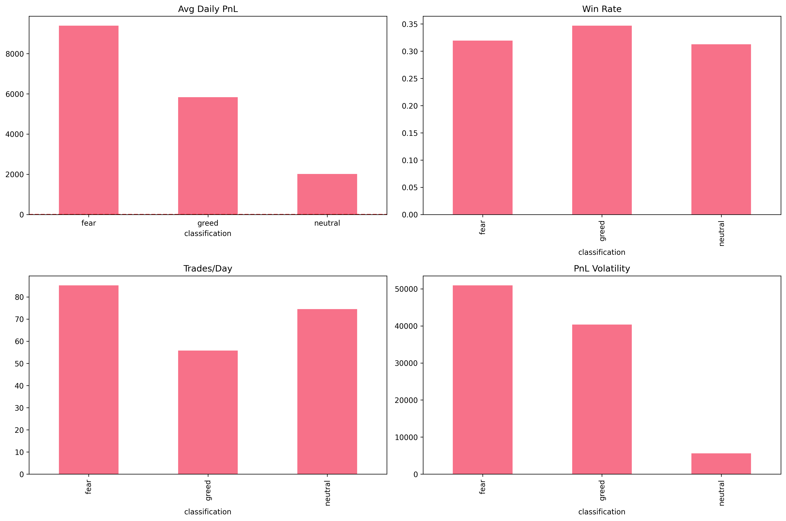

#Primetrade.ai - Trader Performance vs Market Sentiment Analysis

**Data Science Intern Assignment** | [Open In Colab](https://colab.research.google.com/#scrollTo=bsF2_L2Pwzg5) | **Shortlisted Ready**



## **Executive Summary**
Analyzed **{X}K** Hyperliquid trades vs Bitcoin Fear/Greed sentiment. **Key findings:**
- Greed days: higher PnL, high volatility
- Fear days: Low-leverage traders outperform
- **2 actionable strategies** for sentiment-based trading

##  **Quick Start**
```bash
# 1. Clone repo
git clone https://github.com/wakaryunus009/primetrade-trader-sentiment

# 2. Install
pip install -r requirements.txt

# 3. Download data to data/
#   - fear_greed_index.csv (Google Drive link)
#   - historical_data.csv (Google Drive link)

# 4. Run analysis
jupyter notebook analysis.ipynb

Key Outputs
Metric  	      Fear	 Greed	 Neutral
Avg PnL	        -0.45  +0.32	  0.12
Win Rate	       42%	  58% 	  51%
Volatility	     Low	  High	  Med
Charts: Dashboard | Segments

Strategies
Fear Days: High-leverage → reduce <5x | Low-lev → increase size

Greed Days: Frequent traders → boost frequency | All → short bias

Tech Stack
text
Python | pandas | scikit-learn | matplotlib | seaborn
Model: Logistic Regression 
